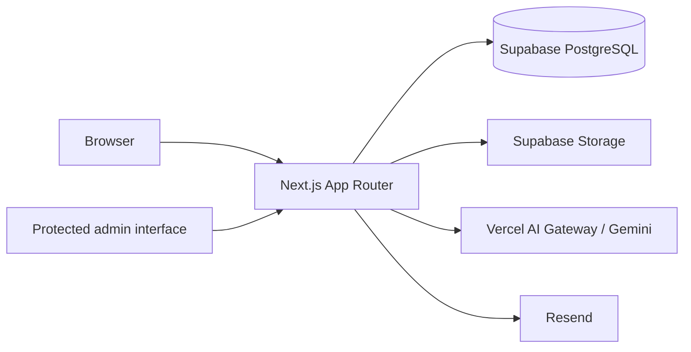

# hazemhassine.space

A personal portfolio and blog website built with Next.js (App Router), React, Tailwind CSS, and Framer Motion.

This project serves as a showcase of my personal and professional projects, built with a dark Neo-Brutalist and cyberpunk design aesthetic. It features a monochrome palette with a striking neon primary accent color (`#ccf200`), grid backgrounds, and stark typography.

## Key Features

- **Interactive 3D WebGL Components**: Built using `three`, `@react-three/fiber`, and `@react-three/drei` for dynamic, immersive interactions.
- **Smooth Route Transitions**: Implemented via Framer Motion's `AnimatePresence` with a custom `<PageTransition>` wrapper and a frozen route context to preserve state during exit animations.
- **Markdown-Powered Blog**: Supabase-backed blog with published-post filtering and repository Markdown fallbacks.
- **Built-in Admin Editor**: Structured content management with private drafts, page previews, publishing, and revision restoration. Protected administration interface with TOTP authentication and signed JWT cookie sessions. Uses `react-markdown` and `@uiw/react-md-editor` for intuitive content management.
- **Visual Experience Timeline**: A clean, structured timeline showcasing work experience, education, and data-driven project case-study pages.
- **Glitch Typography Effects**: Subtle, randomized monochrome static glitch animations implemented using pure CSS pseudo-elements, clip-path, and data-text attributes.
- **AI Assistant**: Portfolio-scoped AI assistant using Google Gemini through the Vercel AI SDK, with a Forma-inspired Context Vault and dynamic vector retrieval, plus page text selection and direct asking.
- **Contact Management**: Contact delivery through Resend, optional Supabase message persistence, dynamic metadata, Open Graph data, and sitemap generation.

## Tech Stack

tags: `next.js`, `react`, `tailwindcss`, `portfolio`, `blog`, `three.js`, `framer-motion`, `supabase`, `ai`

| Area | Technologies |
| --- | --- |
| Framework | Next.js 16.3.3 (App Router), React 19.2.8 |
| Styling | Tailwind CSS v4, CSS Modules |
| Motion | Framer Motion 13 |
| 3D / WebGL | Three.js, React Three Fiber, Drei |
| Data and storage | Supabase, PostgreSQL, Supabase Storage |
| AI | Vercel AI SDK 6, Google Gemini via Vercel AI Gateway |
| Authentication | TOTP with Node.js Crypto, JWT with `jose` |
| Content | Markdown, `gray-matter`, `react-markdown`, `@uiw/react-md-editor` |
| Email and analytics | Resend, Vercel Analytics |
| Deployment | Vercel, Next.js standalone output, Docker Compose |

## Design and Aesthetics
- **Theme Config**: Custom theme colors and variables are handled via `@theme inline` directly within `app/globals.css`.
- **Typography**: Uses `Inter` for display and `IBM Plex Mono` for a stark, technical feel.

## Architecture

Next.js serves the public pages, dynamic metadata, and server route handlers. Published site content, blog posts, revisions, media metadata, and contact messages are stored in Supabase; repository defaults and local Markdown files allow the public site to render when Supabase is not configured or cannot be reached.

The protected admin interface uses server-side Supabase service-role access for content, post, media, and inbox operations. The chat route builds a constrained context from portfolio and blog data before streaming a Gemini response through the Vercel AI SDK. Contact submissions are validated, optionally persisted to Supabase, and delivered through Resend.



## Project Structure

```text
.
├── app/                 # App Router pages, metadata, and route handlers
├── components/          # UI, motion, WebGL, chat, and admin components
├── content/blog/        # Repository Markdown fallback for blog posts
├── lib/                 # CMS, data access, Markdown, and AI context logic
├── public/              # Static assets and project media
├── supabase/cms.sql     # CMS schema, RLS policies, and storage setup
├── Dockerfile           # Multi-stage container image
└── compose.yaml         # Local container orchestration
```

## Getting Started

These instructions run this personal implementation. For a portfolio intended for customization, use [developer-portfolio-template](https://github.com/HazemHassine/developer-portfolio-template) instead.

### Prerequisites

- Node.js 20.9 or newer and npm. The container setup uses Node.js 22.
- A Supabase project for CMS persistence, blog publishing, media storage, and the contact inbox.
- Vercel AI Gateway credentials for the portfolio assistant.
- A Resend account for contact-form email delivery.
- A TOTP authenticator for administrative access.
- Docker with Compose support if using the container workflow.

The public pages can fall back to repository content without Supabase. Supabase is required for CMS persistence, while the AI and contact-email credentials are needed only for their respective features.

### Installation

```bash
git clone https://github.com/HazemHassine/hazemhassine.space.git
cd hazemhassine.space
npm install
```

### Environment Variables

Create `.env.local` in the repository root with credentials from your own service accounts:

```env
# Supabase — public browser configuration
NEXT_PUBLIC_SUPABASE_URL=
NEXT_PUBLIC_SUPABASE_ANON_KEY=

# Supabase — server only
SUPABASE_SERVICE_ROLE_KEY=

# Admin authentication — server only
ADMIN_TOTP_SECRET=
JWT_SECRET=

# AI / LLM — server only (Google AI Studio or Vercel AI Gateway)
GEMINI_API_KEY=
GEMINI_MODEL=gemini-3.5-flash
AI_GATEWAY_API_KEY=
VERCEL_OIDC_TOKEN=

# Contact email — server only
RESEND_API_KEY=
```

`NEXT_PUBLIC_SUPABASE_URL` and `NEXT_PUBLIC_SUPABASE_ANON_KEY` are intentionally exposed to the browser. Keep the service-role, authentication, AI, and email credentials server-side.

The chat endpoint supports direct Google Gemini API keys via `GEMINI_API_KEY` (or `GOOGLE_GENERATIVE_AI_API_KEY`) from Google AI Studio, or Vercel AI Gateway via `AI_GATEWAY_API_KEY` / `VERCEL_OIDC_TOKEN`. Direct Google AI Studio keys provide fast, free access to `gemini-3.5-flash`.

`ADMIN_TOTP_SECRET` must be a Base32 secret configured in the authenticator used for admin login. Use a separate, high-entropy value for `JWT_SECRET`.

## CMS Setup

1. Create your own Supabase project.
2. Open its SQL Editor and run [`supabase/cms.sql`](./supabase/cms.sql).
3. Configure the Supabase and admin variables in `.env.local`.
4. Start the application and sign in to the local or self-hosted `/admin` route with your authenticator code.
5. Select **Publish everything** once to seed the CMS from the repository defaults.

The SQL setup creates the CMS documents and revisions, published blog posts, contact inbox, and media buckets. Row Level Security exposes published content and public media while keeping drafts, revisions, and contact messages out of public queries. Administrative writes use protected server routes and the Supabase service-role key.

## Scripts

| Command | Description |
| --- | --- |
| `npm run dev` | Start the development server on `127.0.0.1:3000` |
| `npm run build` | Create a Next.js build |
| `npm run start` | Start the built application with Next.js |
| `npm run lint` | Run ESLint |

## Docker

The container setup builds the Next.js standalone server on Node.js 22 Alpine, runs it as a non-root user, and checks `/robots.txt` for container health.

Create `.env.local`, then build and start the service:

```bash
docker compose --env-file .env.local up --build -d
```

Check its status and stop it with:

```bash
docker compose ps
docker compose down
```

The two `NEXT_PUBLIC_*` Supabase values are passed as build arguments because Next.js embeds them in the browser bundle. Server-only credentials are provided at runtime through `.env.local` and are not copied into the image.

## Deployment

The live site is deployed on Vercel and includes Vercel Analytics. Configure the required environment variables in the deployment project before building. The standalone Docker image provides an alternative for environments that can run containers.

## Security Notes

- Never commit `.env.local` or expose server-only credentials to client code.
- Generate unique, high-entropy values for the TOTP and JWT secrets and rotate them if they are exposed.
- Keep `SUPABASE_SERVICE_ROLE_KEY` server-side and review the RLS policies when changing the database schema.
- Restrict administrative access and monitor the protected API routes in deployed environments.
- Use HTTPS and appropriate reverse-proxy request limits for internet-facing container deployments.

These controls reduce common deployment risks but do not constitute a security guarantee. Review the application and infrastructure for your own environment before exposing administrative functionality.

## Learn More

To learn more about the tools used in this project, take a look at the following resources:

- [Next.js Documentation](https://nextjs.org/docs) - learn about Next.js features and API.
- [React Three Fiber](https://docs.pmnd.rs/react-three-fiber/getting-started/introduction) - learn how to build 3D apps in React.
- [Tailwind CSS v4](https://tailwindcss.com/docs) - learn about the new version of Tailwind CSS.
- [Framer Motion](https://www.framer.com/motion/) - learn about animation in React.
